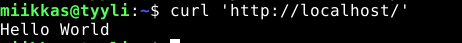
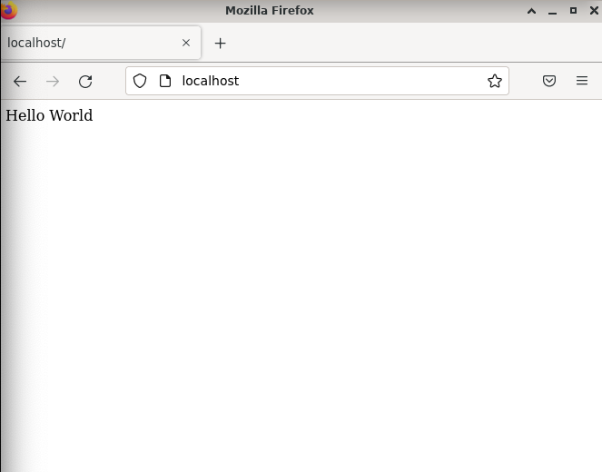
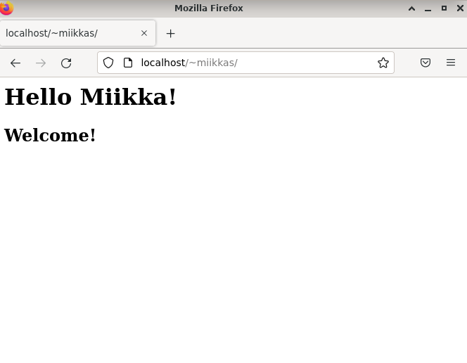
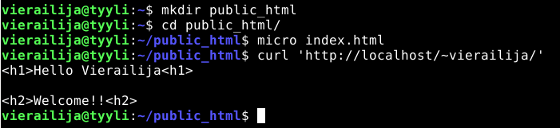
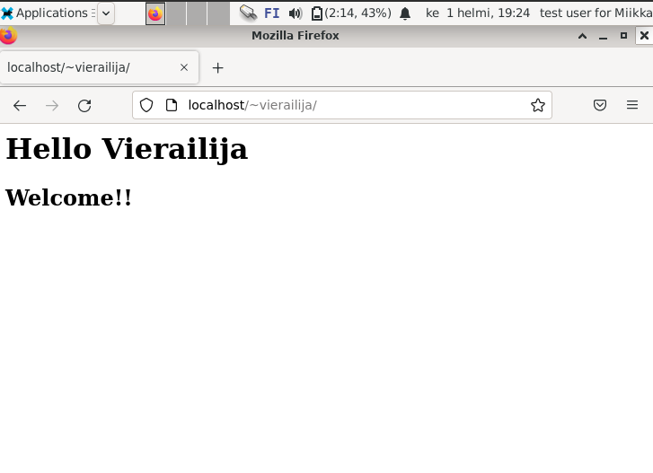
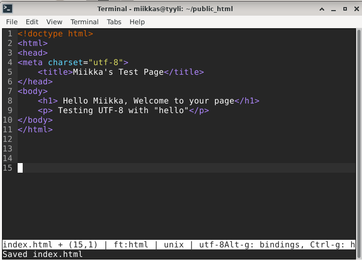
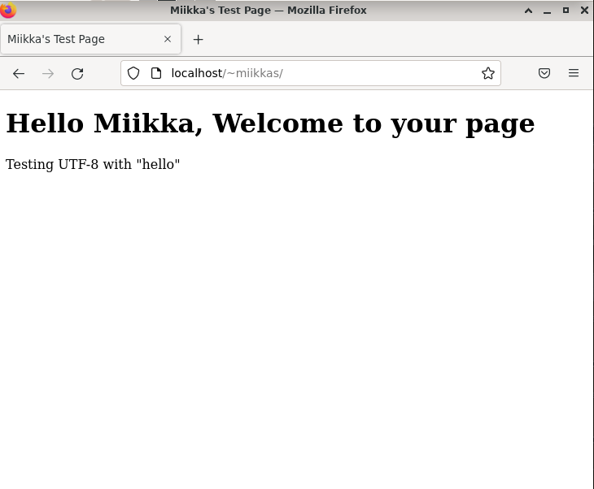
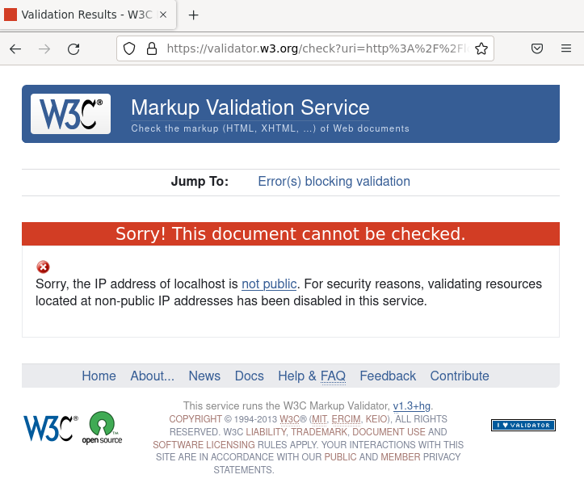
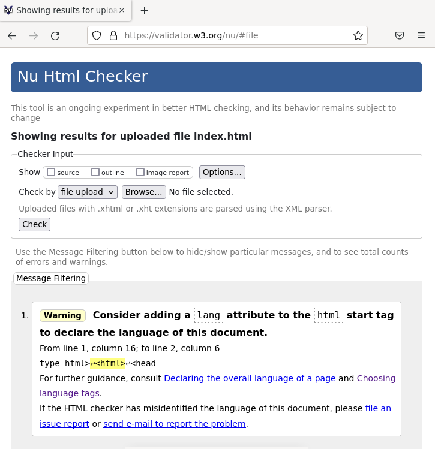

# h5 Tehtävä

x) Kuuntele ja tiivistä. Tiivistelmäksi riittää muutama ranskalainen viiva per artikkeli. (Tässä alakohdassa ei tarvitse tehdä testejä tietokoneella)
Indie Hackers -podcast, vapaavalintainen jakso, jossa hyödynnetään weppiä kaupallisesti.

a) Vaihda Apachen esimerkkisivu johonkin lyheen sivuun niin, että vanha esimerkkisivu ei näy. (Tämä lienee ainoa kohta, jossa ikinä muokkaat weppisivua pääkäyttäjän oikeuksin. /var/www/html/index.html)

b) Laita käyttäjien kotisivut (http://example.com/~tero) toimimaan. Testaa esimerkkikotisivulla.

c) Tee uusi käyttäjä. Kirjaudu ulos omastasi ja sisään uutena käyttäjänä. Tee uudellekin käyttäjälle kotisivu.

d) Tee validi HTML5 sivu.

## x) 

## a) Vaihda Apachen esimerkkisivu johonkin lyheen sivuun niin, että vanha esimerkkisivu ei näy.

Aloitin käynnistämällä apache2 palvelimen komennolla

    $ sudo systemctl start apache2
   
Tarkistin, että palvelin on päällä syöttämällä ``$ curl 'http://localhost/'``. Palvelin antoi vastauksen eli palvelin toimii normaalisti.

Tämän jälkeen vaihdoin normaalin apache2 palvelimen esimerkkisivun vastaamaan "Hello World" tekstin komennolla:

    $ echo "Hello World"|sudo tee /var/www/html/index.html
    
Tarkastin vielä, että palvelin vastaa halutun tekstin komennolla ``$ curl 'http://localhost/'``. Palvelin vastasi halutulla tavalla. 

Tarkastin vielä myös verkkoselaimen kautta näkymän ja nyt esimerkkisivulla näkyi Hello World.

## b) Laita käyttäjien kotisivut (http://example.com/~'...') toimimaan

Aloitin syöttämällä komennon

    $ sudo a2enmod userdir
   
Komento otti käyttöön ``userdir.`` moduulin. Jotta uusi kokoonpano aktivoituu täytyy apache2 palvelin käynnistää uudelleen. Käynnistin palvelimen uudelleen komennolla ``$ sudo systemctl restart apache2``

- Tämän jälkeen tein ensin kotihakemistoon kansion ``public_html`` komennolla: ``$ mkdir public_html``. 
- Menin ``public_html`` kansioon ``cd public_html/`` komennolla. 
- Kansioon tein ``micro`` ohjelmalla ``index.html`` tiedoston komennolla ``micro index.html``. Tiedostoon kirjoitin tekstin, jonka halusin tulostuvan sivulle. 
- Tarkistin, että sivu vastaa halutulla tavalla ``$ curl 'http://localhost/~miikkas/'``. Palvelin vastasi tekstillä, jonka olin kirjoittanut ``index.html`` tiedostoon eli tämä toimii.

Tarkistin vielä verkkoselaimen näkymän ja teksti tuli oikein näkyviin.

## c) Tee uusi käyttäjä

Tein uuden käyttäjän ``vierailija`` seurasin komentokehotteen ohjeita ja syötin käyttäjälle salasanan sekä käyttäjän tiedot kuten käyttäjän nimen. Tässä tapauksessa syötin käyttäjän nimeksi: ``Full Name: test user for Miikka``

Tein myös vieras käyttäjälle kotisivun. 

- Tein kotihakemistoon kansion komennolla: ``$ mkdir public_html`` siirryin kansioon ``$ cd public_html/``
- Tein microlla ``index.html`` tiedoston ``$ micro index.html``, johon kirjoitin tekstin, jonka halusin näkyvän sivulla.
- Testasin toimintaa komentokehotteessa ``$ curl 'http://localhost/~vierailija/'``. Palvelin vastasi kirjoittamallani tekstillä.

Tarkistin vielä verkkoselaimesta, että teksti näkyy.

## d) Tee validi html5 sivu

Muokkasin käyttäjäni kotisivua:

Katsoin miltä se näyttää verkkoselaimella:

Testasin kirjoittamani html tiedoston osoitteessa: https://validator.w3.org/#validate_by_uri 

Koitin ensin testata ``Validate by URI`` menetelmällä. Syötin ``http://localhost/~miikkas/`` sivu kuitenkin vastasi seuraavalla errorilla, ettei sivun tsekkaaminen onnistunut yksityisen ip osoitteen vuoksi.

Valitsin sitten seuraavaksi vaihtoehdoksi ``Validate by File Upload``, jolla sain tsekattua tiedoston.

