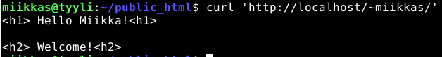

# h5 Tehtävä

## x) Indie Hacker Podcast

### Jakso #246 - Doing Content Right With Step Smith of Trend.co.

- Courtland Allen on podcastin juontaja ja vieraana on Steph Smith. Perustanut Trend.co yrityksen, joka toimittaa uutislehtisiä.
- Monia eri projekteja vuosien varrelta. Uusinpana projektina perustanut Podcastin "The Sh*t You Don't learn in School". Idea syntyi kestävän yhteyden luomisesta ihmisten sekä mahdollisten asiakkaiden kanssa. Verrattuna esimerkiksi sähköpostilla välitettäviin uutiskirjeisiin, podcast luo syvemmän yhteyden ihmisten kanssa lyhyen uutiskirjeen silmäilyn sijaan. Tunnistettavuus myös lisääntyy, joka on hyvä asia esimerkiksi uutiskirjeiden kannalta.
- Smith harmittelee, että opiskelu perustuu pääosin opettamiseen arvosanoja varten. Perustelee, että ihmiset opetetaan hyvin saamaan hyviä arvosanoja, mutta hyvän arvosanan jälkeen asiat eivät jää hyvin muistiin. Kritisoi myös sitä, että nykyajan materiaaleilla testit voisivat olla "open book", koska nykyään on niin valtavasti hyviä materiaaleja saatavilla, joita käytetään myös työelämässä. Miksi koulussa ei opetettaisi hyödyntämään näitä lähteitä, eikä pelkästään muistamaan asioita ulkoa.
- Smith:n mielestä tietojenkäsittelytiedettä pitäisi opettaa jo aikaisesta vaiheesta opinnoista. 
- Smith kävi vaihdossa opintojen aikaan Ruotsissa, kehui Ruotsin opiskelusysteemiä paremmaksi, koska se ei keskittynyt pelkästään niin vahvasti arviointiin tai tietyn % määrän saamiseen kokeista.
-  Nykyajan saatavilla oleva materiaali netin välityksellä mahdollistaa ihmisten oppimisen myös itsenäisesti. Ei tarvita välttämättä isoja opistoja oppimista varten. Erilaisia asioita pystyy todella hyvin oppimaan myös netin välityksellä. Internetin markettiarvo on myös valtava, sen käsittämättömän suuren käyttäjämäärän takia. Smith on esimerkiksi itsenäisesti opetellut koodaamaan.
-  Smith aloitti uuden Podcastin 30 päivän haasteella. Äänittivät joka päivä uuden jakson ja julkaisivat sen yleisölle. Testasivat näin taitoja sekä sitoutumista podcastin tekemiseen. 
-  Allen sekä Smith puhuivat, että tärkeää yrittää paljon eri projekteilla. Kaikki ei onnistu, mutta jotkut projektit voivat lyödä läpi. Varsinkin oppiminen epäonnistuneista projekteista. Epäonnistumisiin ei pidä tarttua liikaa. 
-  Allen kysyi miten Smith sai podcastin suosioon, sillä niitä on valtava määrä nykyään. Smith sanoo, että perinteiset analytiikka työkalut eivät ole auttaneet podcastin yleisön tavoittamiseen. Smith nosti esiin kaikkien kanavien käyttämisen, joissa on liikennettä sekä yleisöä. Smithille tämä alusta oli Twitter, jossa hänellä oli paljon seuraajakuntaa. Smith teki twiitin aiheesta ennen podcastia, jolloin twiitit tulivat suosituksi ja keräsivät tuhansia tykkäyksiä sekä jakoja. Tämän jälkeen hän twiittasi, että podcast on julkaistu jakson aiheesta, joka toi paljon lisää latauksia sekä ihmisiä kuuntelemaan jaksoa.
-  Allen antoi vielä loppuun ohjeita podcastista. Kehotti kaikkia kiinnostuneita kokeilemaan podcastin tekemistä pienellä kynnyksellä. Smith mainitsi vielä loppuun, että luovuuden varaa on podcasteissa. Monella hyvin samantyylisiä podcasteja. Kehotti ihmisiä kokeilemaan erilaisia tyylejä, eikä pelkästään katsomaan listoja. Hän muistuttaa, että vaikka joillakin podcasteilla on yksinkertaisesti valtava seuraajakunta, täytyy muistaa, että ne eivät välttämättä ole niinkään suosittuja sisällön vuoksi vaan henkilön tunnettavuuden. 

## a) Vaihda Apachen esimerkkisivu johonkin lyheen sivuun niin, että vanha esimerkkisivu ei näy.

Aloitin käynnistämällä apache2 palvelimen komennolla

    $ sudo systemctl start apache2
   
Tarkistin, että palvelin on päällä syöttämällä ``$ curl 'http://localhost/'``. Palvelin antoi vastauksen eli palvelin toimii normaalisti.

Tämän jälkeen vaihdoin normaalin apache2 palvelimen esimerkkisivun vastaamaan "Hello World" tekstin komennolla:

    $ echo "Hello World"|sudo tee /var/www/html/index.html
    
Tarkastin vielä, että palvelin vastaa halutun tekstin komennolla ``$ curl 'http://localhost/'``. Palvelin vastasi halutulla tavalla. 

Tarkastin vielä myös verkkoselaimen kautta näkymän ja nyt esimerkkisivulla näkyi Hello World.

## b) Laita käyttäjien kotisivut (http://example.com/~'...') toimimaan

Aloitin syöttämällä komennon

    $ sudo a2enmod userdir
   
Komento otti käyttöön ``userdir.`` moduulin. Jotta uusi kokoonpano aktivoituu täytyy apache2 palvelin käynnistää uudelleen. Käynnistin palvelimen uudelleen komennolla ``$ sudo systemctl restart apache2``

- Tämän jälkeen tein ensin kotihakemistoon kansion ``public_html`` komennolla: ``$ mkdir public_html``. 
- Menin ``public_html`` kansioon ``cd public_html/`` komennolla. 
- Kansioon tein ``micro`` ohjelmalla ``index.html`` tiedoston komennolla ``$ micro index.html``. Tiedostoon kirjoitin tekstin, jonka halusin tulostuvan sivulle. 
- Tarkistin, että sivu vastaa halutulla tavalla ``$ curl 'http://localhost/~miikkas/'``. Palvelin vastasi tekstillä, jonka olin kirjoittanut ``index.html`` tiedostoon eli tämä toimii.

Tarkistin vielä verkkoselaimen näkymän ja teksti tuli oikein näkyviin.

## c) Tee uusi käyttäjä

Tein uuden käyttäjän ``vierailija`` seurasin komentokehotteen ohjeita ja syötin käyttäjälle salasanan sekä käyttäjän tiedot kuten käyttäjän nimen. Tässä tapauksessa syötin käyttäjän nimeksi: ``Full Name: test user for Miikka``

Tein myös vieras käyttäjälle kotisivun. 

- Tein kotihakemistoon kansion komennolla: ``$ mkdir public_html`` siirryin kansioon ``$ cd public_html/``
- Tein microlla ``index.html`` tiedoston ``$ micro index.html``, johon kirjoitin tekstin, jonka halusin näkyvän sivulla.
- Testasin toimintaa komentokehotteessa ``$ curl 'http://localhost/~vierailija/'``. Palvelin vastasi kirjoittamallani tekstillä.

Tarkistin vielä verkkoselaimesta, että teksti näkyy.

## d) Tee validi html5 sivu

Muokkasin käyttäjäni kotisivua:

Katsoin miltä se näyttää verkkoselaimella:

Testasin kirjoittamani html tiedoston osoitteessa: https://validator.w3.org/#validate_by_uri 

Koitin ensin testata ``Validate by URI`` menetelmällä. Syötin ``http://localhost/~miikkas/`` sivu kuitenkin vastasi seuraavalla errorilla, ettei sivun tsekkaaminen onnistunut yksityisen ip osoitteen vuoksi.

Valitsin sitten seuraavaksi vaihtoehdoksi ``Validate by File Upload``, jolla sain tsekattua tiedoston.

Tämä antoi yhden varoituksen, etten ollut määritellyt kieli attribuuttia tiedostoon.

## Lähteet

Karvinen Tero 2012: https://terokarvinen.com/2012/short-html5-page/
